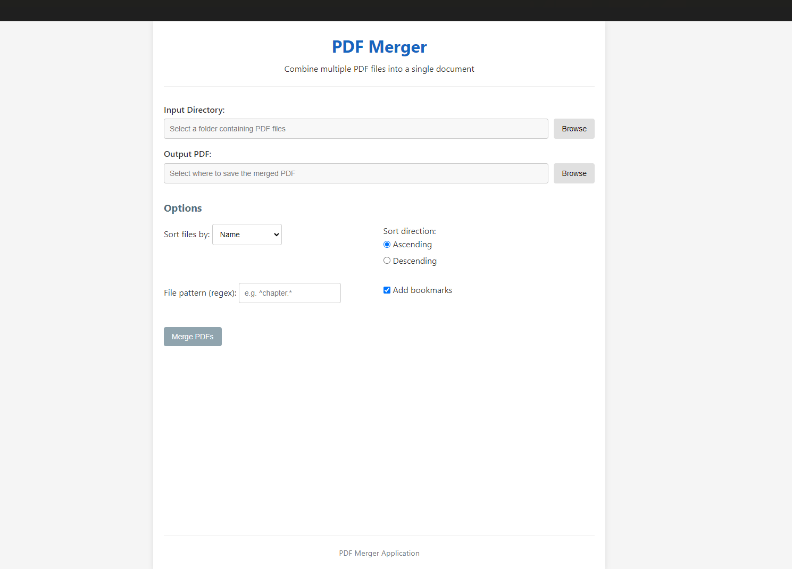

# PDF Merger Tool

[](https://www.npmjs.com/package/pdf-merger-tool)
[](https://opensource.org/licenses/MIT)

A powerful and user-friendly desktop application for merging multiple PDF files into a single document.



## Features

- **User-friendly graphical interface**
- **Command-line interface** for automation and scripts
- **Drag and drop** to reorder PDF files
- **Multiple sorting options** (name, date, size, or custom order)
- **Filter files** using regex pattern matching
- **Bookmark support** for easy navigation in merged PDFs
- **Real-time progress tracking**
- **Cross-platform** - works on Windows, macOS, and Linux

## Installation

### Option 1: Install from NPM (Recommended)

```bash
# Install globally
npm install -g pdf-merger-tool

# Install Electron globally (required for GUI mode)
npm install -g electron

# Run the application
pdf-merger
```

If you prefer to only use the command-line interface (no GUI required):

```bash
# Run in CLI-only mode (no Electron required)
pdf-merger --cli-only --input ./my-pdfs --output ./merged.pdf
```

### Option 2: Download Pre-built Binaries

Download the latest release for your operating system from the [releases page](https://github.com/Nattie-Nkosi/pdf-merger/releases).

### Option 3: Build from Source

```bash
# Clone the repository
git clone https://github.com/Nattie-Nkosi/pdf-merger.git
cd pdf-merger

# Install dependencies
npm install

# Start the application
npm start

# Build for your platform
npm run package
```

## Usage

### Graphical Interface

Simply run `pdf-merger` without any arguments to launch the graphical interface:

```bash
pdf-merger
```

#### Steps:

1. **Select Input Directory**: Click "Browse" to select a folder containing PDF files to merge.

2. **Choose Output Location**: Click "Browse" to select where to save the merged PDF.

3. **Configure Options**:

   - **Sort files by**: Choose how to sort the input files (by name, date, size, or custom order).
   - **Sort direction**: Choose ascending or descending order.
   - **File pattern**: Optionally enter a regex pattern to filter files.
   - **Add bookmarks**: Toggle to add bookmarks in the final PDF.

4. **Reorder Files** (when "Custom order" is selected): Drag and drop files to reorder them, or use the up/down arrows.

5. **Merge PDFs**: Click the "Merge PDFs" button to start the process.

6. **View Result**: Once complete, you can open the merged PDF directly from the application.

### Command Line Interface

For automation or scripting, you can use the command line interface:

```bash
# Basic usage
pdf-merger --input ./my-pdfs --output ./merged.pdf

# Show help
pdf-merger --help
```

#### Available Options:

```
Options:
  --input, -i       Input directory containing PDFs (default: ./pdfs-to-merge)
  --output, -o      Output PDF file path (default: ./merged.pdf)
  --sort-by         Sort files by: 'name', 'date', or 'size' (default: name)
  --descending      Sort in descending order
  --pattern         Regex pattern to match specific filenames
  --no-bookmarks    Disable adding bookmarks to the merged PDF
  --cli-only        Force CLI mode even without other arguments
  --help, -h        Show this help
```

#### Examples:

```bash
# Merge PDFs in chronological order
pdf-merger --input ./reports --output ./merged-report.pdf --sort-by date

# Merge only files that start with 'Chapter'
pdf-merger --input ./book --output ./complete-book.pdf --pattern "^Chapter"

# Merge in reverse alphabetical order without bookmarks
pdf-merger --input ./documents --output ./merged.pdf --sort-by name --descending --no-bookmarks
```

## Programmatic Usage

You can also use PDF Merger Tool as a library in your Node.js projects:

```javascript
const { mergePDFs } = require("pdf-merger-tool");

async function mergeMyPDFs() {
  const options = {
    sortBy: "name",
    descending: false,
    filePattern: "^Report",
    addBookmarks: true,
    onProgress: (progress) => {
      console.log(`Progress: ${progress.message}`);
    },
  };

  const result = await mergePDFs("./my-pdfs", "./merged-output.pdf", options);

  if (result.success) {
    console.log(
      `Success! Merged ${result.fileCount} files with ${result.pageCount} pages.`
    );
  } else {
    console.error(`Error: ${result.message}`);
  }
}

mergeMyPDFs();
```

## Contributing

Contributions are welcome! Please feel free to submit a Pull Request.

1. Fork the repository
2. Create your feature branch (`git checkout -b feature/amazing-feature`)
3. Commit your changes (`git commit -m 'Add some amazing feature'`)
4. Push to the branch (`git push origin feature/amazing-feature`)
5. Open a Pull Request

## Troubleshooting

### Common Issues

#### "Cannot find module 'electron'"

If you see this error when trying to run the GUI application, it means Electron isn't installed globally.

**Solution:**

```bash
# Install Electron globally
npm install -g electron

# Or use CLI mode only (no Electron required)
pdf-merger --cli-only
```

#### "Error: Input directory doesn't exist"

This happens when the default input directory (`./pdfs-to-merge`) doesn't exist and no custom directory is specified.

**Solution:**

```bash
# Create the directory
mkdir pdfs-to-merge

# Or specify a different directory
pdf-merger --input ./your-pdf-folder
```

#### No PDFs Found

If the application says no PDF files were found, check:

1. That your files have `.pdf` extensions
2. That you have permission to read the files
3. That your pattern (if specified) isn't filtering out all files

#### Installation Problems on Linux

On Linux systems, you might need to install additional dependencies for Electron:

```bash
sudo apt-get install libgtk-3-0 libnotify4 libnss3 libxss1 libxtst6 xdg-utils libatspi2.0-0 libdrm2 libgbm1
```

## License

This project is licensed under the MIT License - see the LICENSE file for details.
